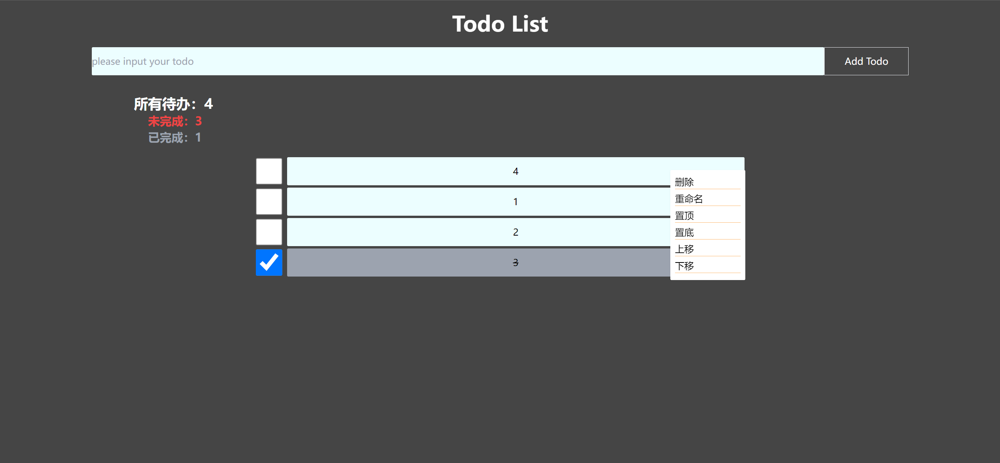

# Simple TodoList

### Function List
-   Base Func:
    -   [x] add
        -   [x] keyboard add
        -   [x] button add
    -   [x] delete
        -   [x] delete singer todoItem
        -   [x] delete all todoItem
-   ContextMenu Operations:
    -   [x] rename some one todoItem
    -   [x] update some one todoItem
    -   [x] storage
    -   [x] top todo
    -   [x] bottom todo
    -   [x] up todo
    -   [x] down todo

### ScreenShot

### Frame
1.  React
2.  Vite
3.  Tailwindcss
